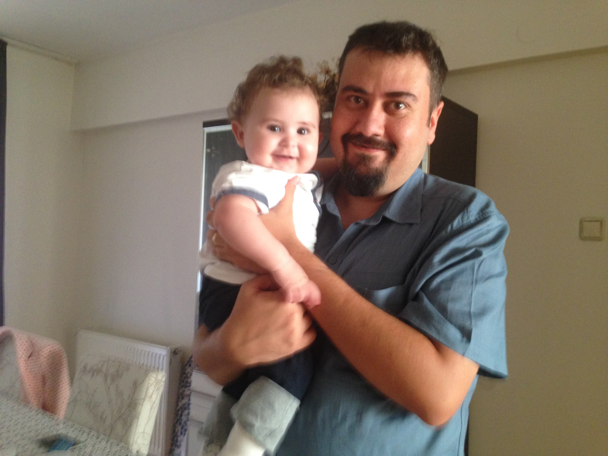

[Home](index.md) | [About](about.md) | [Screenshots](screenshots.md) | [Dev](development.md) | [Archive](archive.md) | [Manual](user_manual.md) 

## About

DEHApad is a really very simple - light notepad application. It is not for programmers or writers. The main feature of the program "was" the sidebar-behavior. Once, there was a good software called Google Desktop. And as its user, I liked it very much. In addition to showing time, hard disk or network information, most of them I liked the notepad part. I used that for years. However, Google stopped to support it. There are some sidepad applications for Windows. However, they are huge and full of non-necessary features. I wanted a notepad sitting at the side. Therefore, as an old amateur Delphi programmer, I have started to code DEHApad with open source and free state-of-art IDE Lazarus and programming language Free Pascal. 

With the time passed and by changing habits, I started to not use this sidebar-feature. With the version 6, which was released at Apr 2021, this sidebar-feature is removed and distraction-free mode for writing is added. And also, by changing habits, I started to use FP/L less and less with time. It did its mission well in the past. I even used it in my company to write commercial applications. However, I am mostly using Python in my daily life and in my academic studies now and therefore I decide to rewrite DEHApad in Python from scratch. First Python versıon of DEHApad will be the version 7 and it will be released in (hopefully) April 2022.

I am a true believer of free software movement. However, I do not plan to make DEHApad open-source. This is my hobby project, and I want it to stay like this. Thanks for understanding. Thank you for visiting, and maybe for trying the DEHApad.

If you have feedbacks and bug reports please do not hesitate to contact me: sblisesivdin-AT-gmail.com

## Versioning
For a one-man small project, I am not using traditional versioning scheme. I am simply using the following linear formula: 

*version = [(d1- d0)/dstep ] + versionstart*

Where *d1*, *d0* and *dstep* are version date, project starting date and version major number step time, respectively. And *versionstart* is the first major number used for first built. For the DApad, d0 is the project start date until Version 0.26.21, with the Version 2.0, d0 is Deha's birthdate, dstep = 365.2422 days and versionstart = 0.0.

## Coding and Licensing
DEHApad Text Editor with Sidebar Behaviour

Copyright (C) 2016-2021 Sefer Bora Lisesivdin

This software is freeware.

## Deha and Bora
The sole programmer of DEHApad is Dr Sefer Bora Lisesivdin. Deha is his son's name :) You can see them below.

