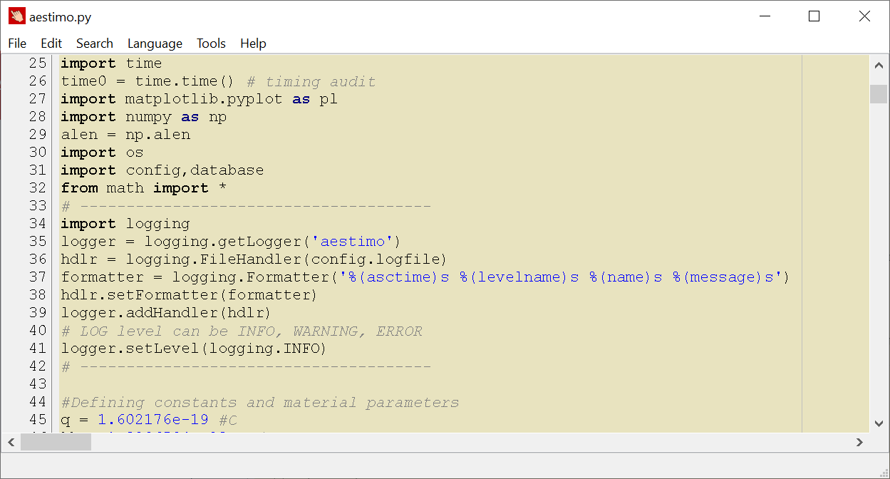

[Home](index.md) | [About](about.md) | [Screenshots](screenshots.md) | [Dev](development.md) | [Archive](archive.md) | [Manual](user_manual.md) 

## Download
The latest version: **v.6.00 (April 21st, 2021)**
Current version for Microsoft Windows OS.

**[Download](https://github.com/sblisesivdin/dehapad/blob/master/Releases/DEHApad-6.00.exe)** 

*Size: 1,333 KB*

*MD5 checksum: 8bcfb666cba33e489d0dca767d035163*

# Features
* **Distraction-Free Mode**: With a key combination you can switch DEHApad from a text-editor to distraction-free writer.
* **Free**: It is free to use (free as in beer)!
* **Highlighting**: DEHApad can show your files highlighted for 17 different languages (Python, Pascal, PHP, HTML, CSS, XML, C++, Java, JavaScript, Perl, UNIX Shell, TEX, SQL, BAT, BAS, INI, PO).
* **Options**: There are many options including different color schemes for two modes of program, printing with options.
* **Encrypt**: You can encrypt/decrypt your text file with a single password.
* **ASCII Art**: You can import BMP pictures to your text files as ASCII art!

## Latest News

**April 2021**
* Happy birthday Deha! Deha is 6 years old, today (Apr 21st). And new version of DEHApad v.6.00 comes in order. In this release, sidebar behaviour is changed to a distraction-free mode. Sidebar mode becomes problematic with each new Windows 10 update. Therefore, code is changed to have a distraction-free mode, instead of having a sidebar. More information can be found in [Dev](development.md) page. BTW, this was the last version of DEHApad that is written in Freepascal/Lazarus. FP/L has been done its mission well to me in the last decade. Even, I used it in my company. However, time is changed and I am mostly using Python for my needs. So it is time to move my hobby code to Python! I will try to move all current features of DEHApad 6 to version 7. I do not plan to announce a new version until Apr 21st, 2022. If someone uses DEHApad, they must know this :)
 
**April 2020**
* Happy birthday Deha! Deha is 5 years old, today (Apr 21st). And new version of DEHApad v.5.00 comes with many new features and bug fixes. In this release, sidebar behaviours are totally changed. Also, BMPtoASCII feature is added. It is quite interesting. Give a shot! Also many important major bug fixes are done. More information can be found in [Dev](development.md) page.

**December 2019**
* 2020 will be the best year for DEHApad. There are already many bugs solved and new features added. They will be release at Version 5! Stay tuned for the v5 that will be released at April 21th.

**April 2019**
* Happy birthday Deha! Deha is 4 years old, today (Apr 21st). And new version of DEHApad comes with (v.4.00) with .LOG feature! Just put ".LOG" in the first line of the file. In every opening the file, recent date and time information will be added end of the file. Also, "Goto line" feature and reaching user documentation from Help menu are added.

**April 2018**
* New version (v.3.00) with autosave feature! Also some links are corrected in the code. Deha is 3 years old today (Apr 21st)! Happy birthday Deha!

**January 2018**
* New version (v.2.76) with highlighting feature for 17 different language. Wordwrapping is disabled due to serious compiling problems. DEHApad is now distributed with GPL v3 license. All code is know on GitHub!

**October 2017**
* New version (v. 2.52) with some windows corrections, and error prevention. DEHApad can open now without setting file. It can create its own settings file if necessary. In addition, it is compiled with the latest version of FPC. 

[News Archive...](archive.md)
